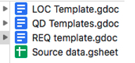
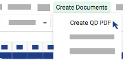

## Document management process
This project involved automating a complex integration process (document management process).
Where different client files are created based on **_templates_**, and then **_client folders_** and **_subfolders_** are also generated.
Then those files are **_categorized according to the stages within each folder._** 

This automation was performed with Google Apps Script. 

A Google Drive folder was created containing the source data spreadsheet and the google doc templates.
Source Data spreadsheet include the data to auto-fill the google doc templates.
Google doc templates are the same word documents, will use them to merge data pulled from the Source Data into the copies made. 

In order to make the user's experience easy and convenient, a customized menu was created with three main documents to generate.

A sub folder in Google Drive contains the qd pdf and client folder: 
QD pdf: The created QD are automatically saved as PDF in this sub-folder.
Client folder: After created the LOC, a client folder will be added and the documents (QD, LOC) will be automatically saved in this sub-folder. 

